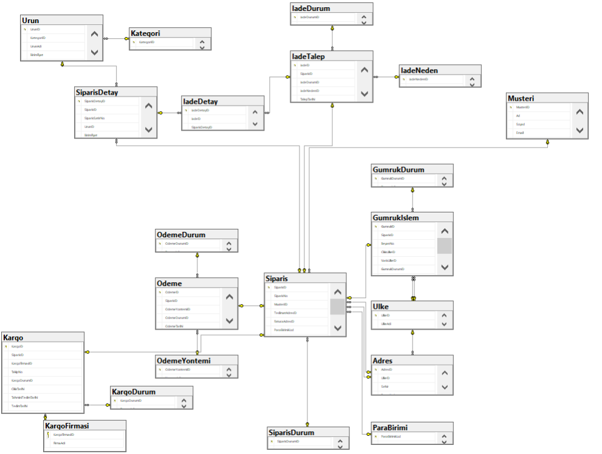
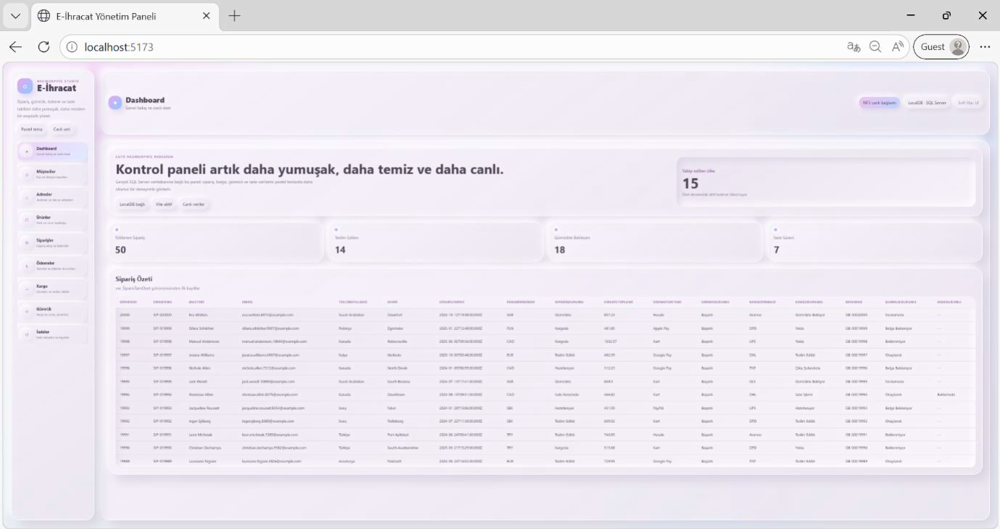
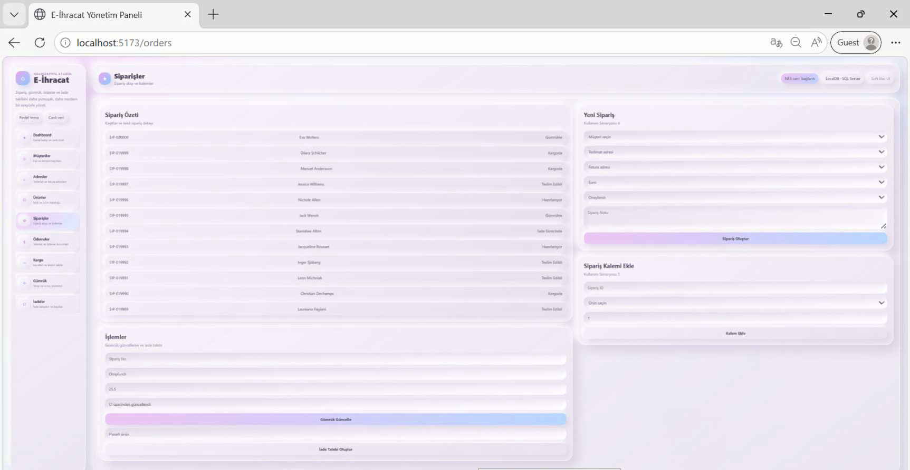
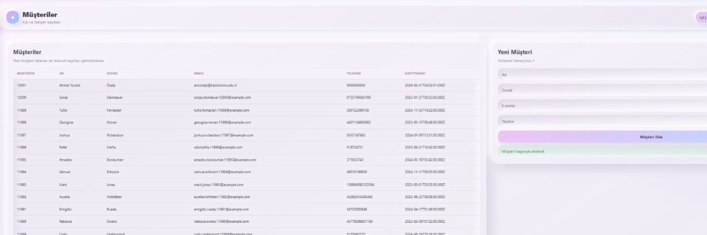
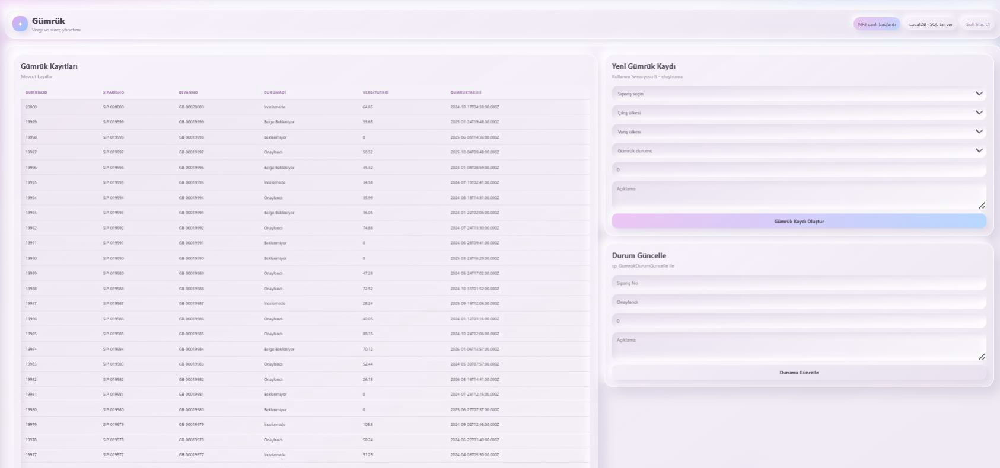
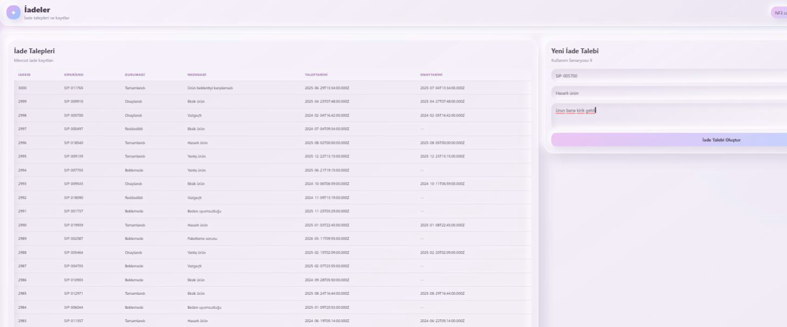
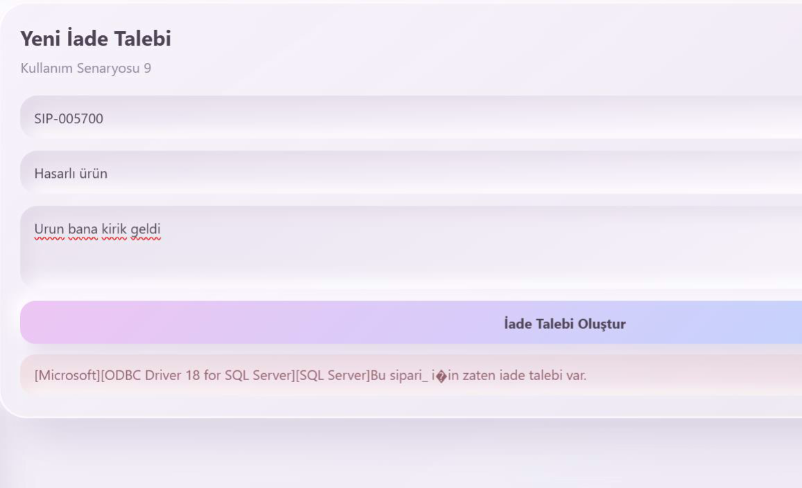

# E-İhracat 3NF Veritabanı ve Admin Dashboard


## Proje Özeti

**E-İhracat 3NF Veritabanı ve Admin Dashboard**, e-ihracat süreçlerinde kullanılan müşteri, adres, ürün, sipariş, ödeme, kargo, gümrük ve iade kayıtlarını yönetmek amacıyla hazırlanmış bir **Veritabanı Yönetim Sistemleri (VTYS)** projesidir.

Proje iki ana bölümden oluşmaktadır:

- **SQL Server veritabanı:** 3NF normalizasyon kurallarına göre modellenmiş ilişkisel veritabanı yapısı.
- **Admin dashboard:** SQL Server veritabanına bağlanan Node.js / Express API ve React + Vite tabanlı yönetim paneli.

Bu çalışma yalnızca tablo oluşturmaya dayalı basit bir veritabanı örneği değildir. Sipariş oluşturma, sipariş kalemi ekleme, müşteri yönetimi, gümrük kaydı oluşturma, gümrük durum güncelleme, kargo takibi ve iade talebi gibi e-ihracat iş süreçlerini uçtan uca gösterecek şekilde tasarlanmıştır.

## Amaç

Projenin temel amacı, e-ihracat alanında karşılaşılan temel veri varlıklarını ilişkisel veritabanı yaklaşımıyla modellemek ve bu modeli çalışan bir yönetim paneli üzerinden test edilebilir hale getirmektir.

Bu kapsamda proje aşağıdaki konuları uygulamalı olarak göstermektedir:

- 3NF kurallarına uygun veritabanı tasarımı
- Birincil anahtar ve yabancı anahtar ilişkileri
- Sipariş, ödeme, kargo, gümrük ve iade süreçlerinin veri modeli
- SQL Server üzerinde view ve stored procedure kullanımı
- Node.js / Express ile REST API geliştirme
- React + Vite ile modern admin panel arayüzü
- SQL Server verisinin web arayüzünde listelenmesi ve yönetilmesi

## Önerilen Repo Bilgileri

**Repo adı:**

```text
e-ihracat-vtys-admin-dashboard
```

**GitHub açıklaması:**

```text
3NF normalizasyonuna göre tasarlanmış SQL Server e-ihracat veritabanı ve React + Node.js tabanlı admin dashboard projesi.
```

## Kullanılan Teknolojiler

| Katman / Amaç | Teknoloji |
|---|---|
| Veritabanı | Microsoft SQL Server |
| Veritabanı Tasarımı | 3NF Normalizasyon, ER Diyagramı |
| Backend | Node.js, Express.js |
| SQL Bağlantısı | mssql, msnodesqlv8, ODBC Driver |
| Frontend | React, Vite |
| Arayüz | HTML, CSS, JavaScript |
| Geliştirme / Test | SSMS, localhost, SQL Server LocalDB / SQLEXPRESS |

## Sistem Mimarisi

```text
Kullanıcı
   ↓
React + Vite Admin Paneli
   ↓
Node.js / Express REST API
   ↓
SQL Server Bağlantısı
   ↓
EIhracat_3NF Veritabanı
```

Projenin frontend kısmı kullanıcı arayüzünü sağlar. Backend kısmı API isteklerini karşılar ve SQL Server veritabanı ile iletişim kurar. Veritabanı tarafında ise sipariş, müşteri, ürün, ödeme, kargo, gümrük ve iade süreçlerini temsil eden ilişkisel tablolar bulunmaktadır.

## Veritabanı Kapsamı

Veritabanı, e-ihracat sürecinde ihtiyaç duyulan temel alanları ayrı tablolar halinde modellemektedir.

| Modül | Açıklama |
|---|---|
| Müşteri Yönetimi | Müşteri kimlik, iletişim ve kayıt bilgilerinin tutulması |
| Adres Yönetimi | Teslimat ve fatura adreslerinin ülke/şehir bilgileriyle saklanması |
| Ürün ve Kategori | Ürünlerin kategori, fiyat ve stok bilgileriyle yönetilmesi |
| Sipariş Yönetimi | Sipariş ana bilgileri ve sipariş kalemlerinin takip edilmesi |
| Ödeme Yönetimi | Ödeme yöntemi, ödeme durumu, işlem numarası ve ödeme tutarının saklanması |
| Kargo Yönetimi | Kargo firması, takip numarası, çıkış ve teslim tarihleri üzerinden kargo takibi |
| Gümrük İşlemleri | Beyan numarası, çıkış/varış ülkesi, vergi tutarı ve gümrük durumu yönetimi |
| İade Yönetimi | İade talebi, iade nedeni, iade durumu ve onay tarihinin takip edilmesi |
| Lookup Tabloları | Durum, neden, ülke, para birimi ve firma gibi tekrar eden değerlerin yönetilmesi |

## 3NF Normalizasyon Yaklaşımı

Veritabanı tasarımında tekrar eden verileri azaltmak, veri bütünlüğünü korumak ve ilişkisel yapıyı daha sürdürülebilir hale getirmek için 3NF yaklaşımı kullanılmıştır.

Bu kapsamda:

- Sipariş bilgileri ile sipariş kalemleri ayrı tablolarda tutulmuştur.
- Ürün ve kategori bilgileri ayrıştırılmıştır.
- Ödeme yöntemi, ödeme durumu, kargo durumu, gümrük durumu ve iade durumu gibi tekrar eden değerler lookup tablolarına alınmıştır.
- Müşteri, adres, ülke ve sipariş ilişkileri yabancı anahtarlar ile bağlanmıştır.
- İade ve gümrük süreçleri siparişe bağlı ayrı işlem tabloları olarak modellenmiştir.

## Öne Çıkan Veritabanı Nesneleri

| Nesne | Amaç |
|---|---|
| `vw_SiparisTamOzet` | Sipariş, müşteri, ödeme, kargo, gümrük ve iade bilgilerinin tek bir özet görünümde birleştirilmesi |
| `sp_GumrukDurumGuncelle` | Belirli bir siparişin gümrük durumunun prosedür üzerinden güncellenmesi |
| `sp_IadeTalebiOlustur` | Sipariş numarasına göre iade talebi oluşturulması ve iş kuralı kontrolünün uygulanması |

## Admin Dashboard Özellikleri

- Genel dashboard üzerinden sipariş, teslimat, gümrük ve iade özetlerinin görüntülenmesi
- Müşteri kayıtlarının listelenmesi ve yeni müşteri eklenmesi
- Adres kayıtlarının listelenmesi ve yeni adres eklenmesi
- Ürünlerin kategori ve stok bilgileriyle görüntülenmesi
- Sipariş oluşturma ve siparişe ürün kalemi ekleme
- Ödeme kayıtlarının görüntülenmesi ve ödeme eklenmesi
- Kargo kayıtlarının takip edilmesi
- Gümrük kaydı oluşturma ve gümrük durumunu güncelleme
- İade taleplerinin listelenmesi ve yeni iade talebi oluşturulması
- SQL Server verilerinin canlı olarak web arayüzünde gösterilmesi

## API Modülleri

| API Modülü | Açıklama |
|---|---|
| `/api/health` | Backend servisinin çalışıp çalışmadığını kontrol eder |
| `/api/health/db` | SQL Server bağlantısını test eder |
| `/api/customers` | Müşteri listeleme ve müşteri ekleme işlemleri |
| `/api/addresses` | Adres listeleme ve adres ekleme işlemleri |
| `/api/products` | Ürün listeleme işlemleri |
| `/api/orders` | Sipariş listeleme, detay görüntüleme, sipariş oluşturma ve sipariş kalemi ekleme işlemleri |
| `/api/payments` | Ödeme listeleme ve ödeme oluşturma işlemleri |
| `/api/shipping` | Kargo kayıtlarını listeleme ve yeni kargo kaydı oluşturma işlemleri |
| `/api/customs` | Gümrük kayıtlarını listeleme ve yeni gümrük kaydı oluşturma işlemleri |
| `/api/returns` | İade taleplerini listeleme işlemleri |
| `/api/lookups/all` | Para birimi, durum, ülke, kategori ve diğer lookup verilerini getirir |

## Proje Yapısı

```text
EIhracat_Admin_Dashboard/
├── backend/
│   ├── routes/
│   │   ├── addresses.js
│   │   ├── customers.js
│   │   ├── customs.js
│   │   ├── lookups.js
│   │   ├── orders.js
│   │   ├── payments.js
│   │   ├── products.js
│   │   ├── returns.js
│   │   └── shipping.js
│   ├── db.js
│   ├── server.js
│   ├── utils.js
│   └── package.json
│
├── frontend/
│   ├── src/
│   │   ├── components/
│   │   ├── pages/
│   │   ├── styles/
│   │   ├── api.js
│   │   ├── App.jsx
│   │   └── main.jsx
│   ├── index.html
│   ├── vite.config.js
│   └── package.json
│
├── start-dev.cmd
└── README.md
```

## Ekran Görüntüleri

Aşağıdaki ekran görüntüleri, projenin hem veritabanı modelini hem de çalışan admin dashboard arayüzünü göstermektedir. Görseller sayesinde proje, bilgisayara kurulmadan da genel akış ve sistem kapsamı açısından incelenebilir.

> Görsellerin README içinde görünmesi için ekran görüntülerini `docs/screenshots/` klasörüne aşağıdaki dosya adlarıyla kaydedin.

```text
docs/screenshots/
├── 01-veritabani-er-diyagrami.png
├── 02-dashboard-genel-bakis.png
├── 03-siparis-yonetimi.png
├── 04-musteri-yonetimi.png
├── 05-gumruk-yonetimi.png
├── 06-iade-yonetimi.png
└── 07-iade-is-kurali-hata-kontrolu.png
```

### 1. Veritabanı ER Diyagramı



Bu ekran, e-ihracat veritabanının ilişkisel yapısını göstermektedir. Müşteri, adres, ürün, sipariş, sipariş detay, ödeme, kargo, gümrük ve iade tabloları arasındaki ilişkiler yabancı anahtarlar üzerinden modellenmiştir. Diyagram, veritabanının 3NF yaklaşımına uygun şekilde modüllere ayrıldığını ve süreçlerin merkezi olarak sipariş tablosu etrafında kurgulandığını göstermektedir.

### 2. Dashboard Genel Bakış



Dashboard ekranı, sistemdeki sipariş kayıtlarını ve temel durum göstergelerini özetlemektedir. Toplam sipariş sayısı, teslim edilen siparişler, gümrükte bekleyen kayıtlar, iade sürecindeki siparişler ve takip edilen ülke sayısı gibi bilgiler yöneticiye hızlı bir genel bakış sunar. Bu ekran, `vw_SiparisTamOzet` görünümünden alınan verilerin arayüzde raporlanmasına örnektir.

### 3. Sipariş Yönetimi



Sipariş yönetimi ekranı, mevcut siparişlerin listelenmesini, sipariş detaylarının incelenmesini ve yeni sipariş oluşturulmasını sağlar. Sağ taraftaki form üzerinden müşteri, teslimat adresi, fatura adresi, para birimi ve sipariş durumu seçilerek yeni sipariş kaydı oluşturulabilir. Ayrıca siparişe ürün kalemi ekleme, gümrük durumunu güncelleme ve iade talebi başlatma gibi süreçler de bu modül üzerinden desteklenir.

### 4. Müşteri Yönetimi



Müşteri yönetimi ekranı, veritabanındaki müşteri kayıtlarını listelemekte ve yeni müşteri ekleme işlemini desteklemektedir. Ad, soyad, e-posta ve telefon bilgileri üzerinden müşteri kaydı oluşturulabilir. Bu ekran, müşteri verisinin sipariş ve adres modülleriyle ilişkili şekilde yönetildiğini göstermektedir.

### 5. Gümrük Yönetimi



Gümrük yönetimi ekranı, siparişlere ait gümrük kayıtlarının izlenmesini ve yeni gümrük kaydı oluşturulmasını sağlar. Form alanları üzerinden sipariş, çıkış ülkesi, varış ülkesi, gümrük durumu, vergi tutarı ve açıklama bilgileri girilebilir. Ayrıca gümrük durum güncelleme işlemi stored procedure kullanılarak gerçekleştirildiği için veritabanı iş mantığının uygulama arayüzüyle birlikte çalıştığı görülmektedir.

### 6. İade Yönetimi



İade yönetimi ekranı, mevcut iade taleplerini listelemekte ve yeni iade talebi oluşturmayı desteklemektedir. Sipariş numarası, iade nedeni ve açıklama alanları üzerinden iade süreci başlatılır. Bu ekran, e-ihracat sisteminde satış sonrası süreçlerin de veritabanı modeline dahil edildiğini göstermektedir.

### 7. İş Kuralı ve Hata Kontrolü



Bu ekran, aynı sipariş için tekrar iade talebi oluşturulmaya çalışıldığında sistemin veritabanı tarafındaki iş kuralını çalıştırdığını göstermektedir. Stored procedure tarafından dönen hata mesajı arayüzde kullanıcıya iletilir. Bu yapı, yalnızca veri ekleme değil, aynı zamanda veri bütünlüğü ve iş kuralı kontrolünün de sistemde ele alındığını göstermesi açısından önemlidir.

## Kurulum ve Çalıştırma

### 1. Gereksinimler

Projeyi çalıştırmak için aşağıdaki araçların kurulu olması gerekir:

```text
Node.js 20+
SQL Server / SQL Server Express / LocalDB
SQL Server Management Studio veya Azure Data Studio
ODBC Driver 17 veya 18 for SQL Server
```

### 2. Veritabanını SQL Server'a ekleme

`EIhracat_3NF.mdf` veritabanı dosyasını SQL Server Management Studio üzerinden attach ederek veritabanını kullanıma açın.

SSMS üzerinden:

```text
Databases → Right Click → Attach → Add → EIhracat_3NF.mdf → OK
```

Daha sonra aşağıdaki sorgu ile veritabanının doğru instance altında açıldığını kontrol edebilirsiniz:

```sql
SELECT @@SERVERNAME AS ServerName, DB_NAME() AS CurrentDatabase;
```

### 3. Backend ayarları

`backend/.env.example` dosyasını örnek alarak `backend/.env` dosyası oluşturun.

```env
PORT=4000
DB_SERVER=(localdb)\mssqllocaldb
DB_DATABASE=EIhracat_3NF
DB_DRIVER=ODBC Driver 18 for SQL Server
DB_TRUSTED_CONNECTION=true
DB_TRUST_SERVER_CERTIFICATE=true
```

SQL Server Express kullanıyorsanız `DB_SERVER` değeri genellikle şu şekilde olabilir:

```env
DB_SERVER=.\SQLEXPRESS
```

veya bilgisayar adınıza göre:

```env
DB_SERVER=COMPUTERNAME\SQLEXPRESS
```

### 4. Backend'i çalıştırma

```bash
cd EIhracat_Admin_Dashboard/backend
npm install
npm run dev
```

Backend varsayılan olarak aşağıdaki adreste çalışır:

```text
http://localhost:4000
```

Bağlantı testleri:

```text
http://localhost:4000/api/health
http://localhost:4000/api/health/db
```

`/api/health/db` başarılı cevap veriyorsa API, SQL Server veritabanına bağlanmıştır.

### 5. Frontend'i çalıştırma

Ayrı bir terminal açarak:

```bash
cd EIhracat_Admin_Dashboard/frontend
npm install
npm run dev
```

Frontend varsayılan olarak aşağıdaki adreste çalışır:

```text
http://localhost:5173
```

### 6. Windows için hızlı başlatma

Paket içinde bulunan `start-dev.cmd` dosyası backend ve frontend servislerini ayrı terminal pencerelerinde başlatmak için kullanılabilir.

> İlk çalıştırmadan önce `backend` ve `frontend` klasörlerinde `npm install` komutlarının çalıştırılmış olması gerekir.

## Akademik Kazanımlar

Bu proje aşağıdaki VTYS ve yazılım geliştirme konularını uygulamalı olarak göstermektedir:

- 3NF normalizasyon kurallarına göre veritabanı modelleme
- ER diyagramı oluşturma ve ilişkisel tablo tasarımı
- Birincil anahtar ve yabancı anahtar ilişkilerini kullanma
- Lookup tabloları ile tekrar eden verileri yönetme
- View kullanarak raporlama amaçlı birleşik veri görünümü oluşturma
- Stored procedure ile iş kurallarını veritabanı seviyesinde uygulama
- SQL Server veritabanını Node.js backend ile kullanma
- React tabanlı admin panel üzerinden veritabanı işlemlerini yönetme
- Gerçekçi e-ihracat senaryolarını veritabanı sistemi üzerinde modelleme


## Lisans

Bu proje akademik amaçlı olarak geliştirilmiştir. Kaynak gösterilerek incelenmesi ve geliştirilmesi önerilir.
